# Technical Readme

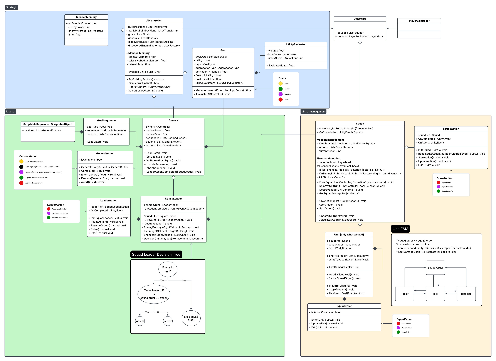
 

## Micro Management

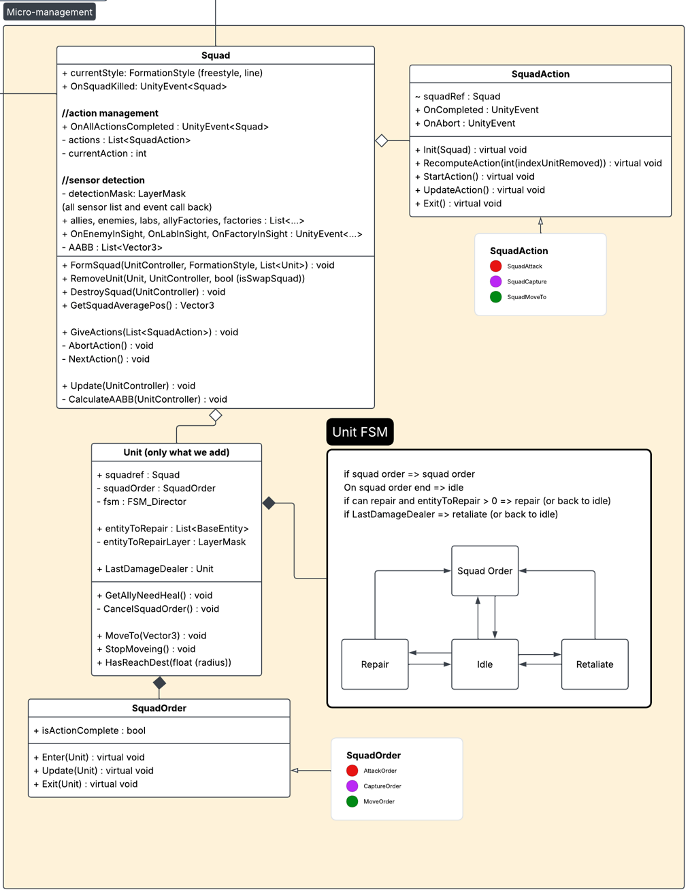

### Introduction
We first considered, from the player’s perspective, how to interact with our units.

We create “Squads” made up of the selected units.

We create these squads the moment the player clicks to perform an action with the selected units.

We form the squad, updating the other squads if we take one of their units.

Then, once the squad is formed, we issue orders to it.

These take the form of a sequence because, if we want to attack, we must first move to the attack zone, then get into an attack position, then attack and manage the attack.

The same applies to capture. And it’s even simpler for basic movement.

The squad then transmits the instructions to these units (move, attack, capture); these are the “SquadOrders”.

We now have units controlled by a squad, with a sequence of actions to achieve a goal set by the player.

### FSM
We then wanted to refine the individual behaviour of the units. We implemented a State Machine (FSM) to handle the transition when a unit receives a squad order. If the unit completes its order, it transitions to “Idle”. From this state, it can either transition back to “SquadOrderState” if it receives a new order. Alternatively, the unit can counter-attack if it is under attack, or repair nearby units, including factories.

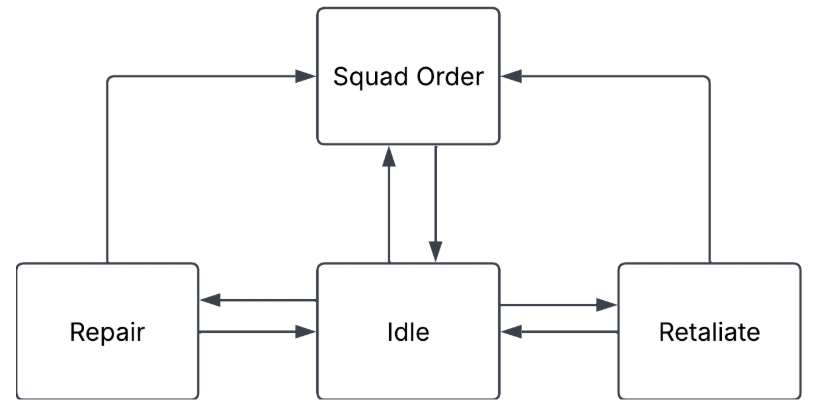

We chose an FSM because there wouldn’t be much state to manage and the relationships weren’t complex, given that the unit would spend most of its time in “SquadOrderState”. Furthermore, the time available for the project and the fact that there were only two of us encouraged us to opt for a structure that was relatively simple and easy to implement.

We then considered how the AI would interact with these squads.
 

## Strategic Layer
The startegic layer is in charge of establishing broad goals based on current game information.

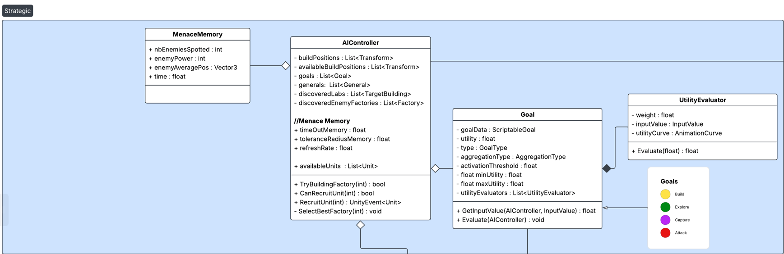

### AI Controller

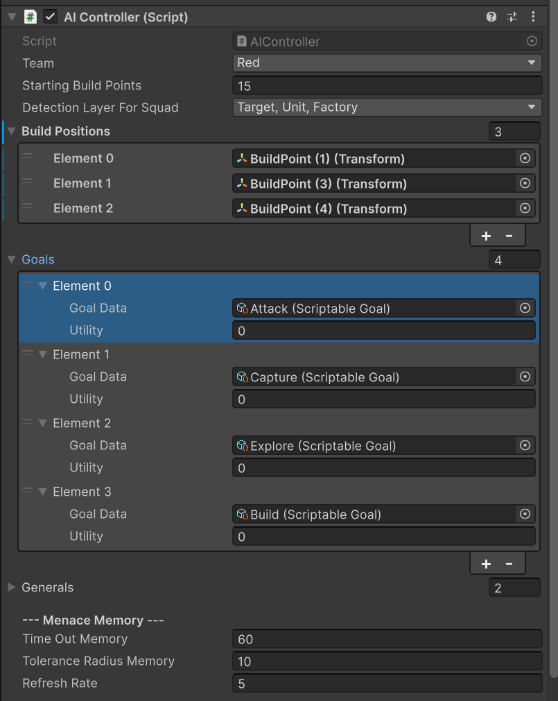

the AI Controller class acts as both the blackboard and the decision making, using an Utility system. It contains both the goals, and the generals (which we will talk about later).

### Goals

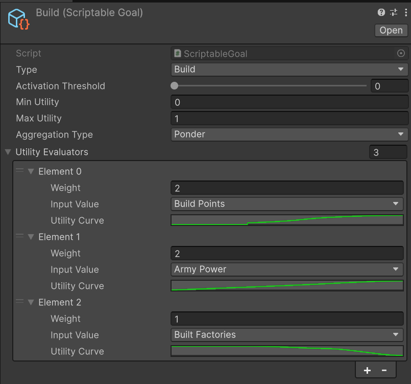

Each goal is comprised of a type, variables controlling its utility output such as activation threshold (utility = 0 below), clamping values and the aggregation type: Ponder each evaluator's weight, Maximize by picking the highest evaluator value or Minimizing by picking the lowest evaluator value, and finally a list of utility evaluators (see below).

### Utility
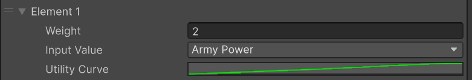

Each goal has a list of utility evaluator, which have an input value and a curve. The ipnut value is an enmu which gets converted and passed in by the goal.

 

## Tactical Layer

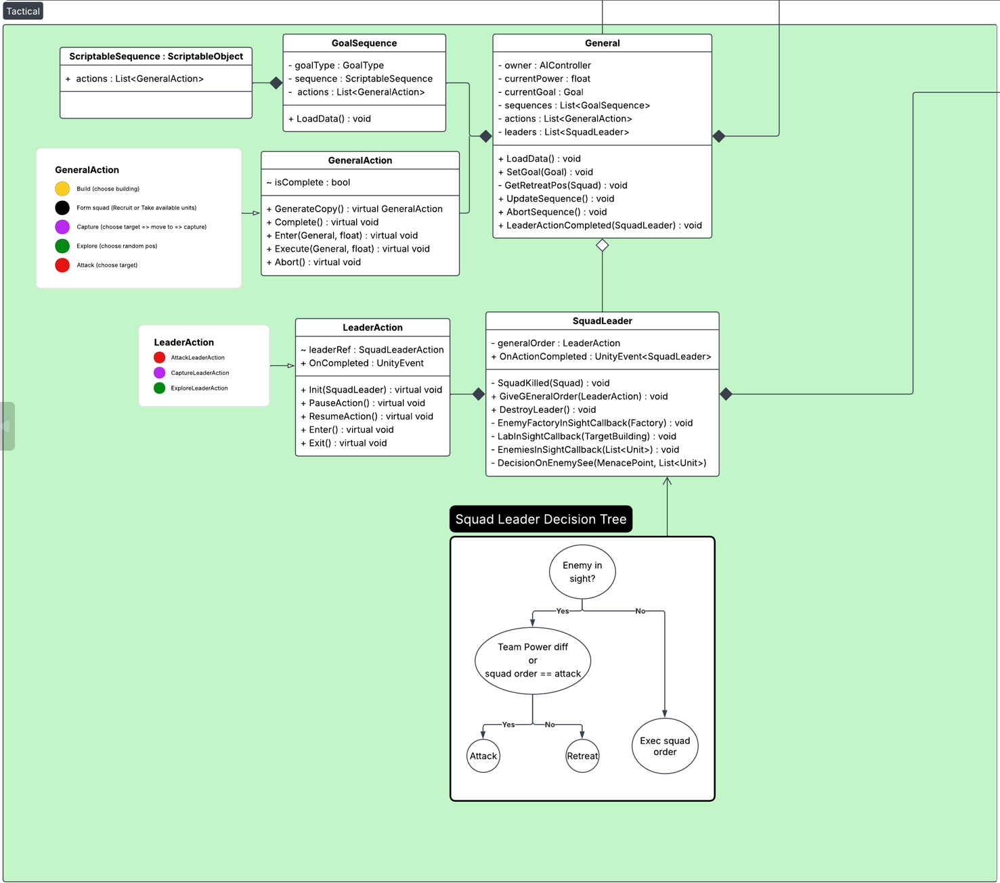

### General

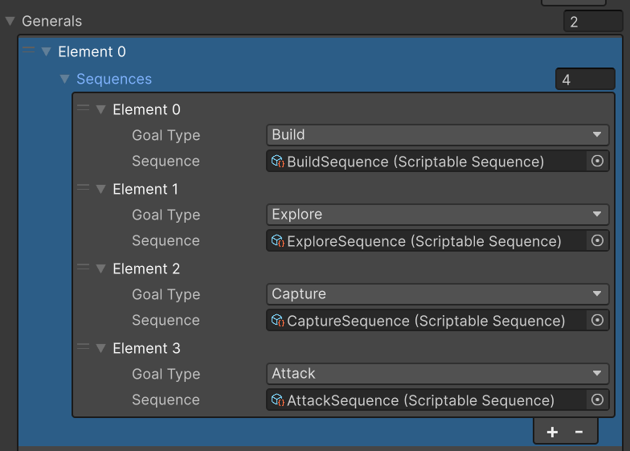

The generals live inside the AIController. They are given a goal of higher utility by the AIController. The general is responsible for translating that goal into a sequence of actions, and execute them. The translation happens with an enum: each goal has a GoalType, and each sequence is tied to a GoalType as well, so that each goal has a corresponding sequence. The general has a set of squad leaders under its orders.

### Goal Sequences

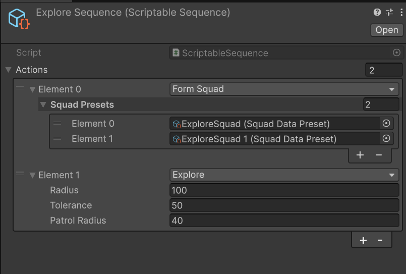

A goal sequence is a series of general actions that get executed in order. The sequence is runned by the general, and it can be aborted. When it is complete, the general's currentGoal is set to null, and it is given a new goal.

### General Actions

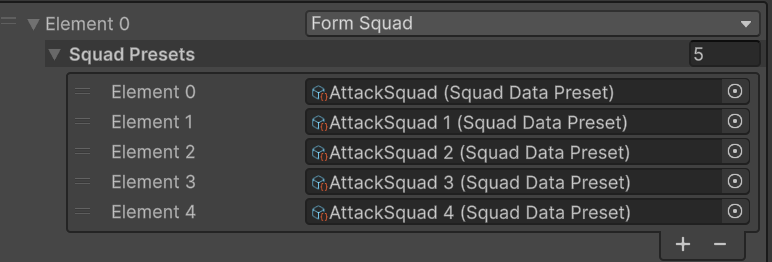

General actions are macro actions:
- Build: build a factory in one of the building positions
- Form Squad: form a squad based on a squad preset and assign it a squad leader
- Capture: send squad leaders to capture a point
- Attack: send squad leaders to attack target

### Squad Presets

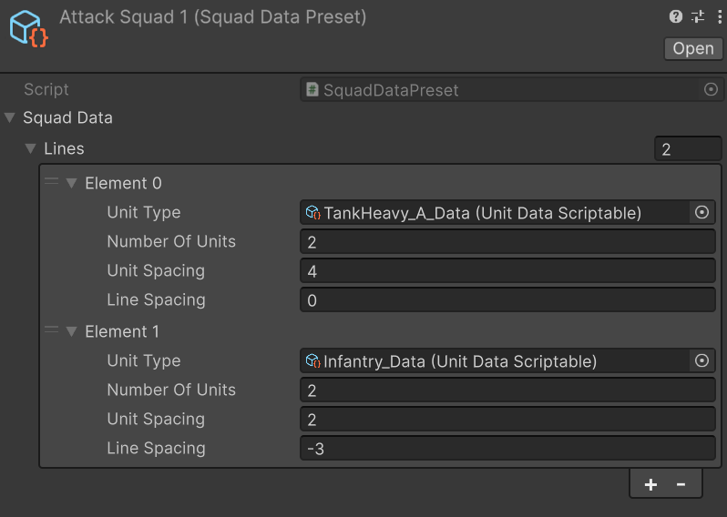
Squad presets are used by Form Squad actions. The action tries to get available units first to see if it ca avoid recruiting new units. If no units are found/match the presets, a new squad is recruited with available budget. Available budget is determined by current goal power (its utility), so that a 0.5 goal doesn't recruit as much as a 1 goal.

### Squad Leader

Finally, the layer closest to the squad is the Squad Leader.

It will essentially relay the GeneralOrder to the squad under its control.

- Attack

    - The squad will head towards the selected threat point to engage the enemy in that area.
    - It will then make a brief sweep around the point to check if there are any enemies nearby.

- Explore:

    - The squad moves to an initial position specified by the general.
    - It will then move the squad randomly across the map.
    - The action ends if the squad finds an enemy or neutral lab.

- Capture:
    - The squad heads towards the lab specified by the general
    - It then captures the point and completes the mission

However, we also wanted to give the AI a semblance of intelligence.

We have implemented a decision tree that allows the general’s order to be paused in order to attack the enemy if the order is to attack, or if our team is stronger than the enemies in sight, or if we spot a factory nearby, in which case we will defend it against the enemy.

Otherwise, the squad leader will disband the squad and all units will return to base, where they may be recruited by another squad leader.

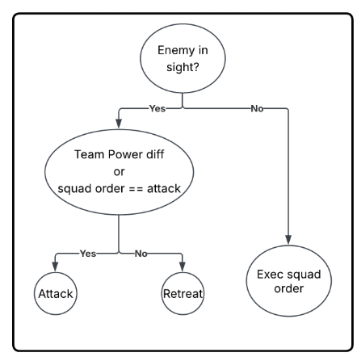

## Analysis

The results are conclusive, the AI reacts to player actions, is able to win but also to lose within a reasonable amount of time. The random creates non deterministic playthroughs which is nice for replayability, but it makes tha AI harder to balance.

### Pros and Cons
(+/-) We used a lot of Event-based programming, which is nice because it avoids logic in update, but it's harder to debug  
(+/-) Random squad presets and explore action creates different playthroughs, which is interesting but can sometimes make the game very hard or very easy 
(+) Squad presets and  goal sequences are more modular than expected, leaving room for variety and multiple sequences for the same goal. 
(+) Squad leader Decision-tree and unit FSM gives autonomy to each squad, giving a conincing illusion of intelligence

### Conclusion

Looking forward, we would like to:
- Add coordinated actions for a general, with multiple squad leaders
- Make the retreat more strategic: choose a lab where the AI doesn't have any unit to defend instead of heading straight back to base
- Tweak goals so that they interact more in harmony with each other
- Better control random in squads and explore action, to ensure the AI is balanced

